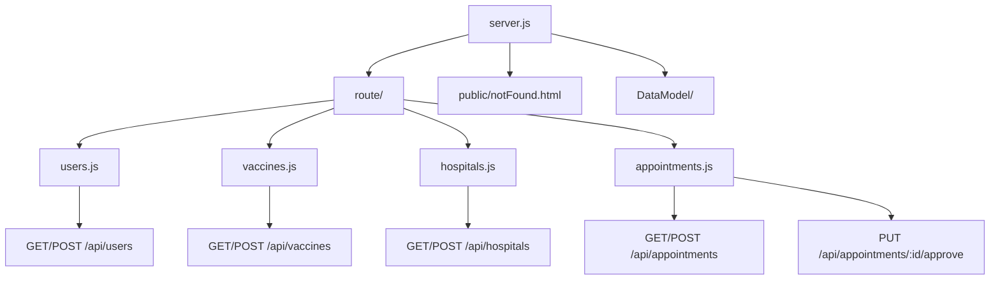

# NodeAPI

This is the backend REST API for the VaccinationProject, built with Express.js and MongoDB (via Mongoose).

## Architecture



## Component Breakdown & Functions

### server.js
- Entry point for the backend server
- Sets up Express, connects to MongoDB (`mongodb://127.0.0.1`)
- Loads all route handlers
- Handles unmatched routes by serving `public/notFound.html`

### route/
- Contains route handlers for each resource:
  - **users.js**: Register users, list users, manage user details
  - **vaccines.js**: Register vaccines, list vaccines, manage vaccine details
  - **hospitals.js**: Register hospitals, list hospitals, manage hospital details
  - **appointments.js**: Create appointments, list appointments, manage appointment status, admin approval/denial

### DataModel/
- Contains Mongoose schemas for each resource:
  - **User**: name, age, profession, contact, address, gender, disease, medicalCertificate
  - **Vaccine**: name, type, price, sideEffect, origin, dosesRequired, otherInfo (array of strains)
  - **Hospital**: name, address, type, charges
  - **Appointment**: date, time, title, location, userId, hospitalId, vaccineId, status
    - Appointments are listed by status. If the appointment date is in the past, it is automatically rejected.

### Approval Workflow
- Only admin can approve or deny appointments
- Approval handled via `PUT /api/appointments/:id/approve` (status: approved/denied)

### Data Storage
- All data is stored in local MongoDB (`mongodb://127.0.0.1`)

### Error Handling
- Unmatched routes serve `public/notFound.html`

## Developer Workflow

```sh
npm install
npm run start # (auto-reload with nodemon)
```

---
